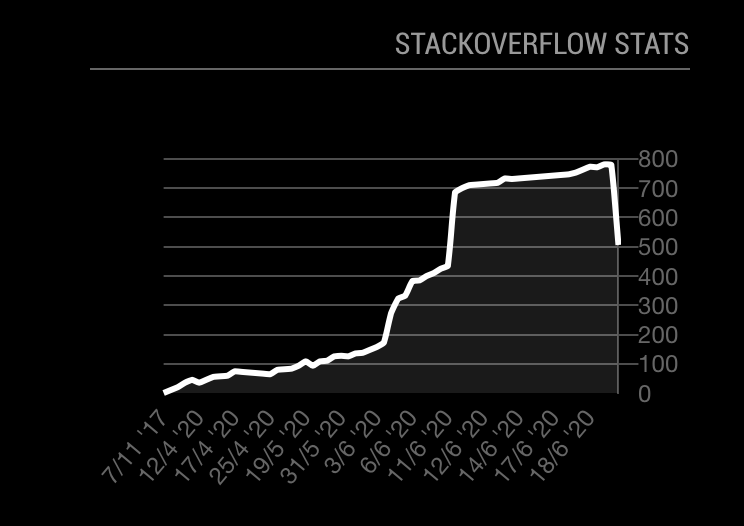

# MMM-SE-Reputation

This is a module for the [MagicMirror²](https://github.com/MichMich/MagicMirror/).

See your reputation of a StackExchange site on your MagicMirror



## Installation

Go to your MagicMirror's Module folder with the terminal:
````bash
cd ~/MagicMirror/modules
````

Clone the repository:
````bash
git clone https://github.com/ChielChiel/MMM-SE-Reputation.git
````

### Authenticate
After installing the module you should authenticate this module to read your reputation.
You can authenticate by going to this url:
https://stackoverflow.com/oauth/dialog/?client_id=18128&scope=private_info,no_expiry&redirect_uri=https://chielchiel.github.io/MMM-SE-Reputation/

After authentication and redirects you will see your code. (On the redirected site, after authentication, you can also autofill this config)s

To use this module, add the following configuration block to the modules array in the `config/config.js` file:
```js
var config = {
    modules: [
        {
            module: 'MMM-SE-Reputation',
            config: {
                authCode: "", //Authentication code retrieved from the url above.
                userId: "", //User id of the site
                updateInterval: 15 * 60 * 1000, //How many milliseconds to a new update
            	site: "stackoverflow", //can be any StackExchange site
            }
        }
    ]
}
```

## Configuration options

| Option           | Description
|----------------- |-----------
| `authCode`        | *Required* The authentication code from the url above. <br><br>**Type:** `string`
| `userId`        | *Required*  Your id on the specific stackexchange site. <br><br>**Type:** `string`
| `updateInterval` | Interval between updating the data <br><br>**Type:** `int`(milliseconds) <br>Default 900000 milliseconds (1 minute)
| `site` | *Required* The name of the StackExchange site. <br><br>**Type:** `string` <br><br> For example stackoverflow or raspberrypi. Omit the `.stackexchange.com` if the site url has it.


## Todo for v2
Feel free to help!
- [ ] Spread graph based on date instead of even spacing between points
- [ ] Add carousel to show graphs of different sites
    - [ ] Option to add multiple sites in config
    - [ ] Setup `node_helper.js` to fetch multiple sites
